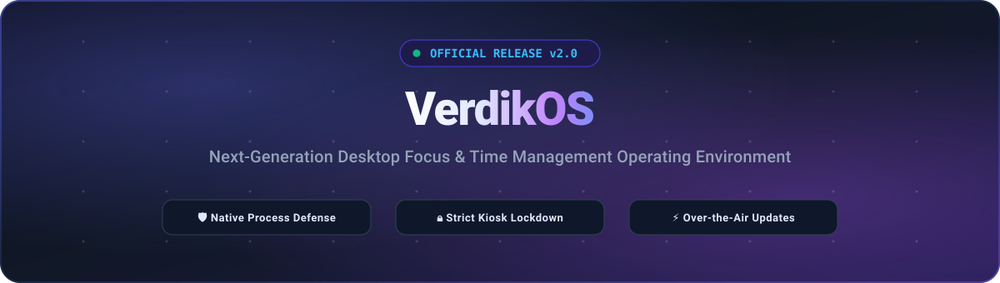

  <!-- Header Banner (Local SVG - 100% Reliable Render) -->
  

    

  <!-- Project Logo (Local logo.png) -->
  

  <h3>⚡ Time Management, Reimagined. ⚡</h3>

  

    <strong>Official releases and installer packages for VerdikOS — the autonomous desktop productivity and focus operating environment.</strong>
  

  <!-- Auto-Detecting Live Badges -->
  

    
    
    
    
    
  

  <!-- Primary One-Click Download Hero Box -->
  

    <table>
      <tr>
        <td align="center" style="padding: 22px 32px; background: linear-gradient(135deg, #1e1b4b 0%, #312e81 100%); border-radius: 18px;">
          <h3>🚀 Ready to Supercharge Your Productivity?</h3>
          
Download the official standalone installer with automated background updates enabled.

          
        </td>
      </tr>
    </table>
  

 

---

## 📑 Table of Contents

- [📥 Download & Installation](#-download--installation)
- [✨ Key Features](#-key-features)
- [🔄 Automated Updates](#-automated-updates)
- [📦 Version History & Release Changelogs](#-version-history--release-changelogs)
- [💻 System Requirements](#-system-requirements)
- [🌐 Official Releases](#-official-releases)
- [🤝 Community & Support](#-community--support)
- [📄 License](#-license)

---

## 📥 Download & Installation

### Step 1: Download the Installer
Click the download badge below or visit the [Releases](https://github.com/XhyNox/VerdikOS-EXE/releases/latest) page:

  

### Step 2: Run Setup
1. Double-click the downloaded setup file.
2. The installer will automatically set up VerdikOS, launch protection, and create desktop and start menu shortcuts.
3. Configure your personalized security PIN on first launch to protect your session policies.

> [!NOTE]
> If Windows SmartScreen appears during installation, click **"More info"** $\rightarrow$ **"Run anyway"**.

---

## ✨ Key Features

<table>
  <tr>
    <td width="50%" valign="top">
      <h3>🛡️ Autonomous Focus Guard</h3>
      <ul>
        <li><b>Native Process Monitoring</b> enforces your digital boundaries with near-instant response.</li>
        <li><b>Instant Restrictive Action</b> suppresses distracting software and unauthorized games during study sessions.</li>
        <li><b>Tamper-Resistant Engine</b> keeps protection active without accidental shutdowns.</li>
      </ul>
    </td>
    <td width="50%" valign="top">
      <h3>🔒 Fullscreen Focus Lock</h3>
      <ul>
        <li><b>Immersive Lockdown Screen</b> eliminates desktop distractions during active study sessions.</li>
        <li><b>Distraction Shield</b> intercepts disruptive desktop switching and distractions.</li>
        <li><b>Emergency Master Reset</b> enables verified recovery whenever necessary.</li>
      </ul>
    </td>
  </tr>
  <tr>
    <td width="50%" valign="top">
      <h3>⏳ 30-Minute Graceful Shutdown Delay</h3>
      <ul>
        <li><b>Cool-Off Shutdown Timer</b> promotes intentional usage by preventing impulsive exits.</li>
        <li><b>Modern Countdown Notification Card</b> displays real-time countdown progress and instant cancellation.</li>
        <li><b>Live Tray Synchronization</b> provides seamless status monitoring in the Windows taskbar.</li>
      </ul>
    </td>
    <td width="50%" valign="top">
      <h3>📊 Productivity Analytics & Streaks</h3>
      <ul>
        <li><b>Real-Time Focus Metrics</b> with daily goal progress, active focus streaks, and app time distribution.</li>
        <li><b>Integrated Pomodoro Engine</b> with customizable focus intervals and breaks.</li>
        <li><b>Target Countdown Timer</b> prominently displayed in the top header.</li>
      </ul>
    </td>
  </tr>
  <tr>
    <td width="50%" valign="top">
      <h3>☁️ Cloud Synchronization & Accounts</h3>
      <ul>
        <li><b>Real-Time Cloud Sync</b> keeps focus policies, blocklists, and streaks in sync across devices.</li>
        <li><b>Seamless Account Authentication</b> with single sign-on & offline mode support.</li>
        <li><b>Custom Avatar Cloud Storage</b> for profile customization and cross-device display.</li>
      </ul>
    </td>
    <td width="50%" valign="top">
      <h3>⚡ Automated Background Updates</h3>
      <ul>
        <li><b>Automatic Over-The-Air Delivery</b> ensures your system always has the latest enhancements.</li>
        <li><b>Silent Background Download</b> with live progress visibility inside the app.</li>
        <li><b>One-Click Update Installation</b> applies upgrades smoothly on demand.</li>
      </ul>
    </td>
  </tr>
</table>

---

## 🔄 Automated Updates

Once installed, VerdikOS keeps itself up to date automatically:

1. **Automatic Detection:** Checks for newly published updates on application launch and during background operation.
2. **Bandwidth-Efficient Downloads:** Downloads updates silently without interrupting your workflow.
3. **In-App Controls:** Access **Help & Support** $\rightarrow$ **⚡ System Updates** to view update status or install updates with a single click.

---

## 📦 Releases & Version Changelogs

All current and past releases, version descriptions, changelogs, and binary assets are automatically tracked, archived, and served directly via GitHub Releases:

   
  
  
  
    
  
    

---

## 💻 System Requirements

| Component | Minimum Requirement | Recommended |
| :--- | :--- | :--- |
| **Operating System** | Windows 10 (64-bit) | Windows 11 (64-bit) |
| **Processor** | Dual-core 2.0 GHz or higher | Quad-core modern processor |
| **Memory (RAM)** | 2 GB RAM | 4 GB RAM or higher |
| **Storage** | 200 MB free disk space | SSD Storage |
| **Internet** | Required for cloud sync & updates | High-speed broadband |

---

## 🌐 Official Releases

* **Binary Distribution Repository:** [github.com/XhyNox/VerdikOS-EXE](https://github.com/XhyNox/VerdikOS-EXE)

---

## 🤝 Community & Support

  
  
  
  
  

    
  
For questions, feature feedback, or technical assistance, feel free to open a GitHub Issue or reach out on Telegram.

---

## 📄 License

This project is licensed under the **ISC License**. See the [LICENSE](LICENSE) file for full details.

  Built with ❤️ by <b>XhyNox</b> and the <b>VerdikOS Team</b>.

